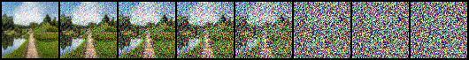
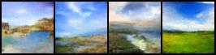

# Diffusion-Model-Implementation

Scratch implementation of DDPM and Conditional DDPM (classifier free guidance).

# Inference Image:

# References:
- https://lilianweng.github.io/posts/2021-07-11-diffusion-models/
- https://huggingface.co/blog/annotated-diffusion
- https://wandb.ai/geekyrakshit/diffusers-image-generation/reports/Unconditional-Image-Generation-Using-HuggingFace-Diffusers--VmlldzoyOTM5NjA1
- https://dataflowr.github.io/website/modules/18a-diffusion/
- https://github.com/dome272/Diffusion-Models-pytorch
- https://youtu.be/cS6JQpEY9cs
